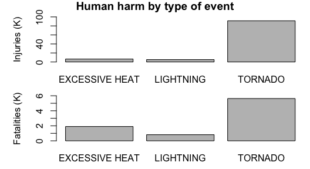

Most damaging climate events across the USA
================
Ander Elkoroaristizabal
9/1/2020

## Abstract

In this analysis we answer the following two questions:

1.  Across the United States, which types of events (as indicated in the
    EVTYPE variable) are most harmful with respect to population health?
2.  Across the United States, which types of events have the greatest
    economic consequences?

We will consider the impact of each event type additively, i.e., the
impact of each event type will be the sum of all the events inside this
type We leave the option of considering the average damage for later.

## Data processing

We download the dataset from the given
[link](https://d396qusza40orc.cloudfront.net/repdata%2Fdata%2FStormData.csv.bz2).
The explanatory documentation may be found
[here](https://d396qusza40orc.cloudfront.net/repdata%2Fpeer2_doc%2Fpd01016005curr.pdf).

``` r
if (!file.exists("StormData.csv.bz2")){
  download.file("https://d396qusza40orc.cloudfront.net/repdata%2Fdata%2FStormData.csv.bz2",
                "StormData.csv.bz2")}
Storm_data = read.csv(bzfile("StormData.csv.bz2"))
```

No data preprocessing is needed in order to answer our questions.

<!-- We next process the dataset.  -->

<!-- First we correct the BGN_DATE, BGN_TIME, END_DATE and END_time formatting,  -->

<!-- and add a new columns displaying date and time together. -->

<!-- ```{r Data_processing} -->

<!-- # Formatting of beggining dates & times -->

<!-- Storm_data$BGN_DATE = sapply(strsplit(Storm_data$BGN_DATE," "),`[`, 1) -->

<!-- Storm_data$BGN_TIME = paste(substr(Storm_data$BGN_TIME,1,2), -->

<!--                             substr(Storm_data$BGN_TIME,3,4), -->

<!--                             sep = ":") -->

<!-- Storm_data$BGN_DATETIME = with(Storm_data, paste(BGN_DATE, BGN_TIME)) -->

<!-- Storm_data$BGN_DATETIME = as.POSIXct(Storm_data$BGN_DATETIME,  -->

<!--                                      format = "%m/%d/%Y %H:%M") -->

<!-- # Formatting of ending dates & times -->

<!-- Storm_data$END_DATE = sapply(strsplit(Storm_data$END_DATE," "),`[`, 1) -->

<!-- Storm_data$END_TIME = substr(Storm_data$END_TIME,1,5) -->

<!-- Storm_data$END_DATETIME = with(Storm_data, paste(END_DATE, END_TIME)) -->

<!-- Storm_data$END_DATETIME = as.POSIXct(Storm_data$END_DATETIME,  -->

<!--                                      format = "%m/%d/%Y %H:%M") -->

<!-- ``` -->

## Results

### 1\. Most harmful event types (with respect to population health)

To observe the harm done by each event type we will do two barplots, one
of injured people and another one of fatalies. The events shown in the
plots are the ones in both the top five injuring and the top five
killing.

``` r
library(dplyr)

hdamage_by_type = group_by(Storm_data, EVTYPE) %>% 
  summarise(INJURIES = sum(INJURIES), FATALITIES = sum(FATALITIES))

worst_events = intersect(hdamage_by_type[order(-hdamage_by_type$INJURIES),][1:5,],
                   hdamage_by_type[order(-hdamage_by_type$FATALITIES),][1:5,])

par(mfrow = c(2,1), mai = c(0.5, 0.5, 0.1, 0.1))
barplot(INJURIES~EVTYPE, 
        worst_events,
        xlab = "")
barplot(FATALITIES~EVTYPE, 
        worst_events,
        xlab = "")
```



The answer to question one is clear: Tornados are by far the most
harmful event in the US.

### 2\. Event types with greatest economic consequences

What do the exponents mean? E.g.:

``` r
table(Storm_data$PROPDMGEXP)
```

    ## 
    ##             -      ?      +      0      1      2      3      4      5      6 
    ## 465934      1      8      5    216     25     13      4      4     28      4 
    ##      7      8      B      h      H      K      m      M 
    ##      5      1     40      1      6 424665      7  11330
